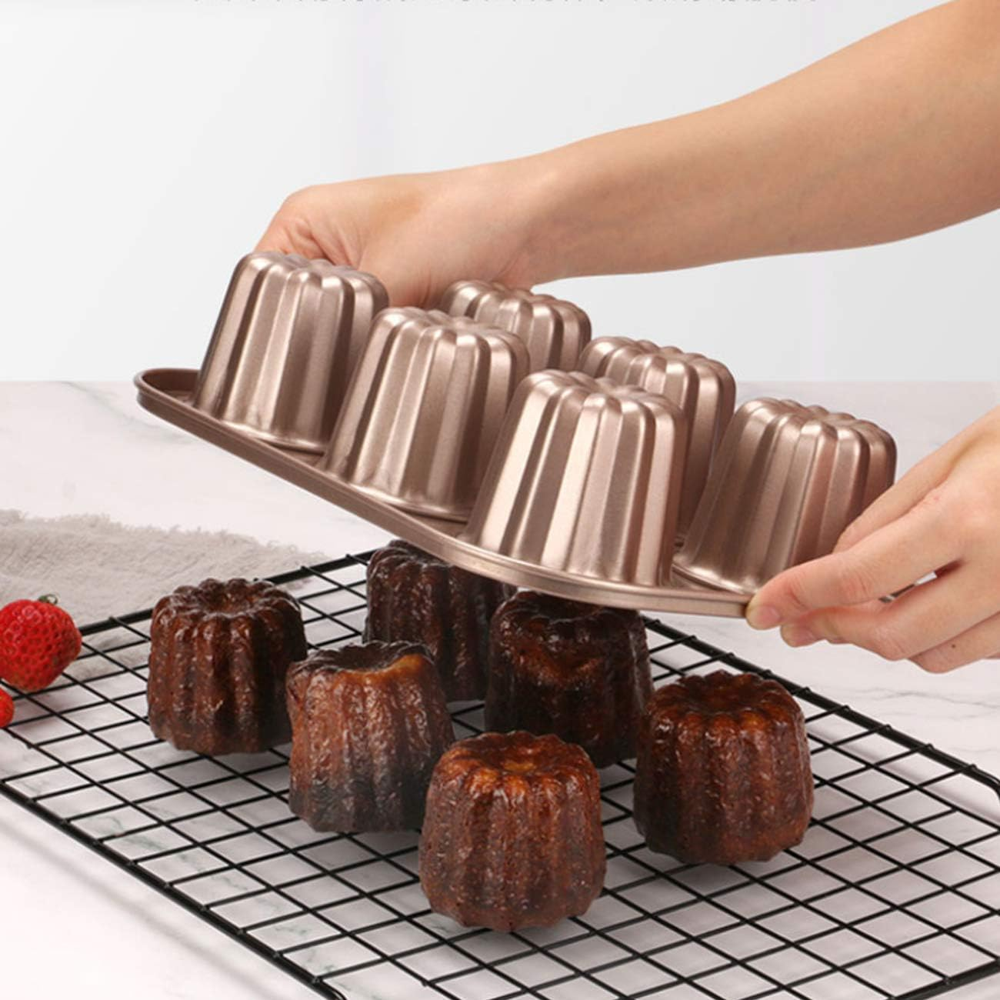
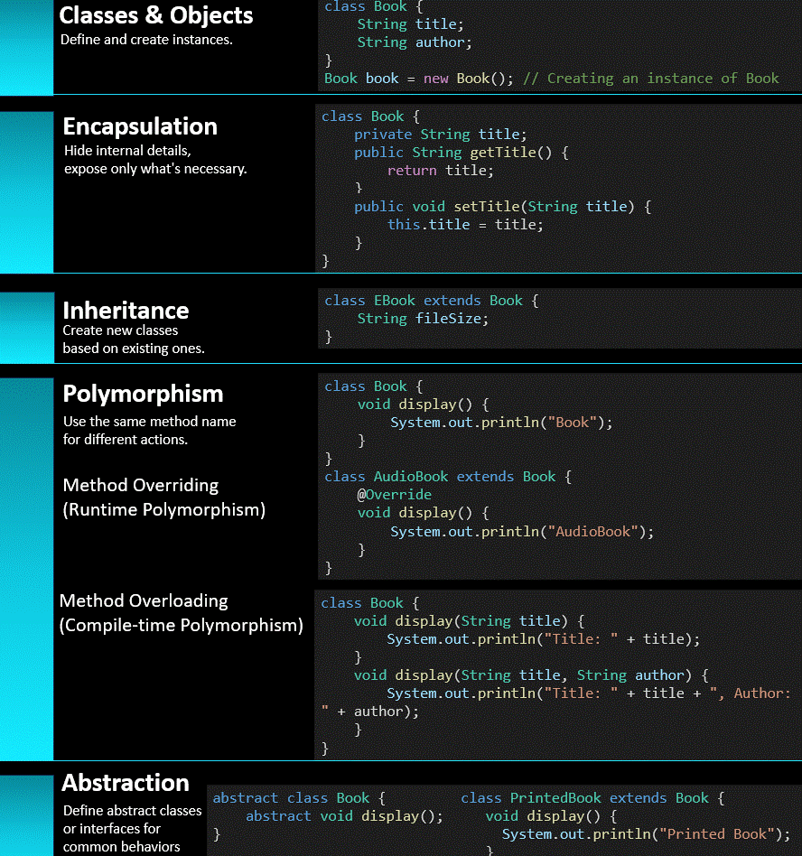

# Object Oriented Programming

## Class

Classes are just like the molding of an actual product. For example, the picture described below is a molding of creating cakes. So, we molded and put various ingredients into different types of cakes. But the molding gives the actual shape.

> Just like cake molding, **a class is a blueprint for an entity**. Entities are actual, real-life representations that a class is capable of producing.

-   Here is one thing - the shape of the cake is always the same. But we can have different flavors, which the mold doesn't care about. We can prepare chocolate cake, vanilla cake, or strawberry cake, which is totally up to you. So, properties are not strictly prohibited or maintained by the class itself; the maker of a product or object can tweak around his product or property.

## Benefits:

1. Code reusability is enforced due to OOP. Once we create a class with objects, we don't need to redefine the same property again and again. Just think about a student program, where a student have some properties like name, roll, age, cgpa and more. You create one student like this, then second but when it comes to 100th student you back off and get bored because of you're writing same code for name, age, roll, age, cgpa or other for each of the student. Hereby, OOP create a flexible template for you.

## Access modifiers

1. **Private**: Data and properties aer only accessible within the class body.
2. **Public**: Data and properties are accessible to everyone that means even outside the class, it is possible to access the properties by object that are created out of the class.
3. **Protected**:

&nbsp;

<!-- TODO: Edit the image and replace the code with C++ code -->

## Pillars of OOP
